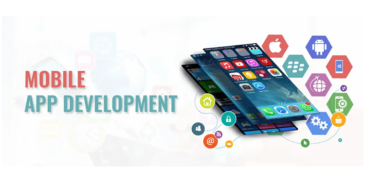
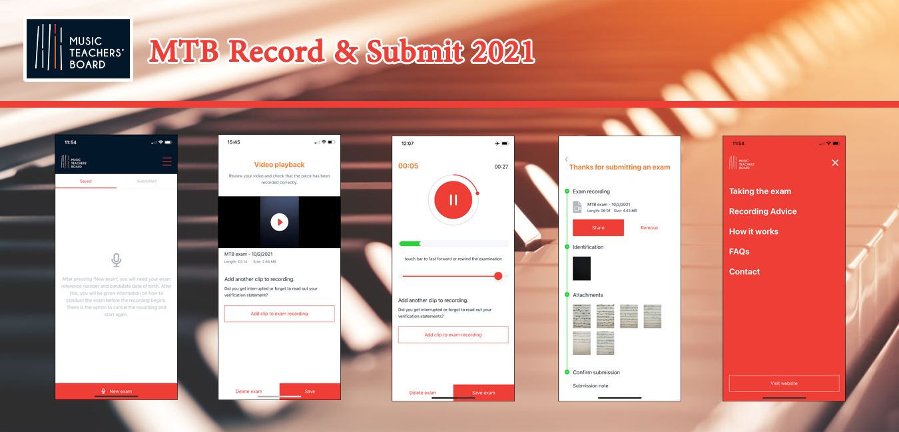
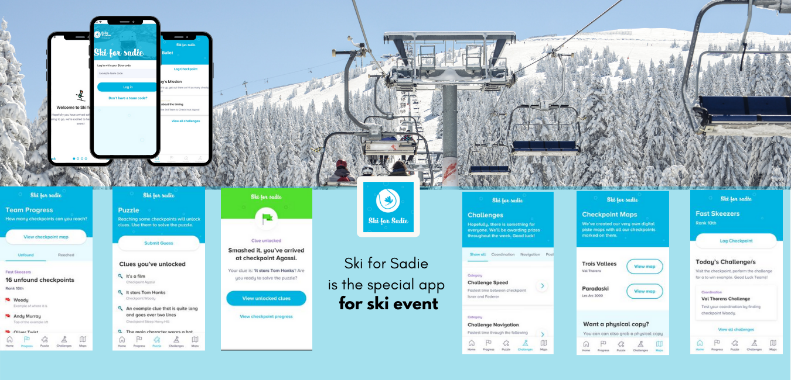
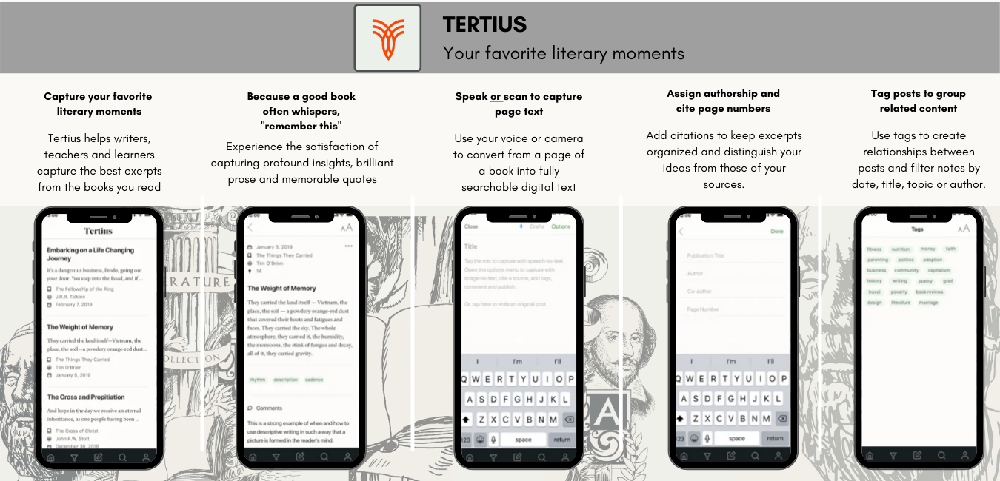

## Stefan Bogeski
# Mobile Software Engineer

## Bio
 

I am a professional mobile application developer with 7 years of development experience and I am Master's degree in Computer Science. I have worked on various mobile areas including application development, firmware customization, AI, Computer Vision and WebRTC for last 7 years. And also I have extensive experience in building native Android/iOS applications as well as developing application on cross-platform like React Native, Flutter and Ionic.

Over years of experience in building mobile applications, I acquired deep knowledge of solving complex problems using cutting edge technologies. I am constantly learning new frameworks and technologies to work even more efficiently and write even better code.

I appreciate all considerations for development work. Please feel free to reach out or invite me to a project if you feel my services would benefit!
 
## Portfolio

### MTB Record & Submit 2021 - [iOS](https://apps.apple.com/us/app/mtb-record-and-submit-2021/id1552918129) | [Android](https://play.google.com/store/apps/details?id=com.mtbexams.recordsubmit2021) | [Web](https://www.mtbexams.com/)

### Ski for Sadie - [iOS](https://apps.apple.com/in/app/ski-for-sadie/id1492585646) | [Android](https://play.google.com/store/apps/details?id=co.uk.redbullet.skiforsadie&hl=en&gl=US)

### Tertius - [iOS](https://apps.apple.com/us/app/tertius-read-capture-grow/id1441909218?ls=1) | [Web](https://tertius.app/)

## Skills

- Hybrid Application Development: React Native, Ionic(Cordova & Capacitor), Flutter
- Native Application Development: Java/Kotlin, Swfit
- WebRTC: Jitsi, Zoom, Janus...
- Firmware Custom
- Computer Vision
- Cloud Service: Firebase, AWS(Lambda, Amplify, ...), Alibaba, Airtable, ...
- Database: SQLITE, Realm, PostgreSQL, MySQL, MongoDB
